## 🦉 The Daily Fable

*Every morning, [`claude-fable-5`](https://www.anthropic.com/news/claude-fable-5-mythos-5) — Anthropic's Mythos-class model — writes an original micro-fable just for this page. No two days are the same. Today's:*

<!--FABLE:START-->
> **The Broken Reel** — *Audiences forgive a broken reel sooner than a polished lie.* (11 Jun 2026)
<!--FABLE:END-->

📜 [Browse the full archive of past fables →](fables/)

---

### About me

Stories, strategy, cinema, and AI — usually all four at once. I write about what films teach us about management, and what AI teaches us about everything else.

🎬 Cinema-to-business frameworks · 📰 *Director's Cut* weekly newsletter · 🤖 Building with Claude

---

This README rewrites itself daily via GitHub Actions + the Claude API. Themes rotate: AI · leadership · cinema · Panchatantra.

